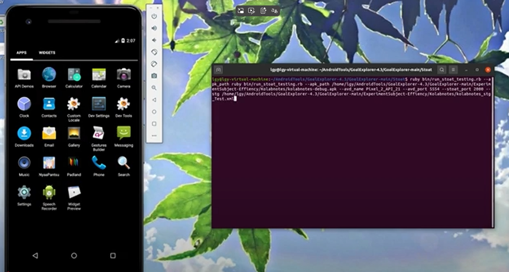

# ACPDroid

## Demo video of how to execute ACPDroid
Youtube [ACPDroid](https://www.youtube.com/watch?v=6VdClNX3CDQ) https://www.youtube.com/watch?v=6VdClNX3CDQ



## License
This project is licensed under the MIT License.

# Option 1. Running in the virtual machine (recommended)
Virtual VM download links: 
- [Download](https://drive.google.com/file/d/14K7R1qwWSTJDzpj1NwRj1rMQGjwQ1a0T/view?usp=sharing)
the provided image can be run on VMware® Workstation 16 Pro onwards as this version starts supporting nested virtualisation for running Android Emulator on both Intel and AMD CPUs.

## Prerequisites

- VMware® Workstation 16 Pro onwards. Download from [VMware](https://www.vmware.com/)
- Ensure your CPU supports nested virtualisation.
- Download the VM file from this repository.

# Option 2. Running on your local environment
## Installation Instructions
This package will work on Linux system. There are many binaries that the scripts rely on so there are no guarantees on other platforms. 
1. Install Ruby
2. Install [Nokogiri](https://nokogiri.org/tutorials/installing_nokogiri.html)
3. Install Python 3.7
4. Install [uiautomator](https://github.com/xiaocong/uiautomator)
5. Install [FlowDroid](https://github.com/secure-software-engineering/FlowDroid/)
6. Install [Backstage](https://github.com/uds-se/backstage)
7. Install [Gator](http://web.cse.ohio-state.edu/presto/software/gator/)
8. Install [APKTool](https://apktool.org/)

Backstage : Detecting Behavior Anomalies in Graphical User Interfaces

Install Android SDK through [Android Studio](https://developer.android.com/studio).
Through either Android Studio or the [sdkmanager](https://developer.android.com/studio/command-line/sdkmanager) binary, install the following packages.
1. build-tools;25.0.0 (Android SDK Build-Tools 25.0.0)
2. android-25 (Android 7.1 API level 25)
3. Android Emulator
4. Android SDK platform-tools

Then add the following lines to your .bashrc/$PATH after you find where your Android SDK had been installed. 

```shell script
export ANDROID_HOME = <Android SDK Path>

export PATH=$PATH:$ANDROID_HOME/tools
export PATH=$PATH:$ANDROID_HOME/tools/bin
export PATH=$PATH:$ANDROID_HOME/platform-tools
export PATH=$PATH:$ANDROID_HOME/build-tools/25.0.0

```


Install the necessary SDK components

```shell script
sdkmanager --install "platform-tools" "emulator"
```

Install system image
Assuming you want to create an x86_64 emulator for Android 13 (API 33):

```shell script
sdkmanager --install "system-images;android-33;google_apis;x86_64"
```

List of available system images

```shell script
sdkmanager --install "system-images;android-33;google_apis;x86_64"
```

Create AVD（Android Virtual Device）

```shell script
avdmanager create avd -n MyEmu -k "system-images;android-33;google_apis;x86_64" --device "pixel"
```


## Usage 
Start the emulator

```shell script
./emulator @Pixel_2_API_30 -port 5554
```

View emulator list
```shell script
./emulator -list-avds
```

Usage of static components
```shell script
java -jar target/GoalExplorer-1.2-SNAPSHOT-jar-with-dependencies.jar ge -i 'path to the apk file of app under test' -s 'your sdk path' -o sootOutput --target 'target'
```

Usage of dynamic components
```shell script
ruby bin/run_stoat_testing.rb --apk_path 'path to the apk file of app under test' --avd_name 'your created avd' --avd_port 'avaliable port' --stg 'path to the generated stg file'
```


Example (using klobe notes as an example)
```shell script
ruby bin/run_stoat_testing.rb --apk_path ruby bin/run_stoat_testing.rb --apk_path /you/local/path/ExperimentSubject-Effiency/Kolabnotes/kolabnotes-debug.apk --avd_name 'your created avd' --avd_port 5554 --stg /you/local/path/ExperimentSubject-Effiency/Kolabnotes/kolabnotes_stg_Test.xml
```


